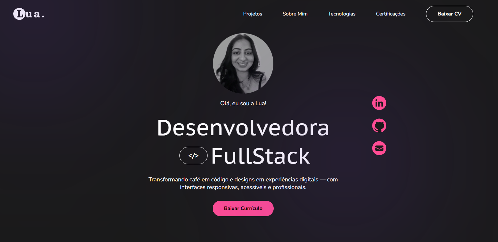

# 💜 Luana Specht | Desenvolvedora Full Stack

Bem-vindo(a) ao repositório do meu portfólio profissional!  
Este projeto foi desenvolvido para apresentar minhas habilidades, projetos e certificações na área de desenvolvimento web.

🔗 **Acesse o portfólio online:**  
https://portfolio-pied-ten-56.vercel.app/

---

## 🌐 Preview do Projeto

<p align="center">
  
</p>

---

## ✨ Sobre o Projeto

Este portfólio foi desenvolvido com foco em organização, clareza e experiência do usuário.  
A proposta é demonstrar não apenas conhecimento técnico, mas também atenção aos detalhes visuais, responsividade e boas práticas de desenvolvimento.

O design prioriza:

- Interface moderna e limpa  
- Estrutura componentizada  
- Código organizado  
- Experiência fluida e intuitiva  

---

## 🚀 Tecnologias Utilizadas

- **React**
- **JavaScript (ES6+)**
- **HTML5 & CSS3**
- **Flexbox**
- **Componentização**
- **React Hooks (useState)**

---

## 🎯 Funcionalidades

✔ Seção Hero personalizada  
✔ Apresentação profissional  
✔ Seção de tecnologias  
✔ Carrossel de certificações  
✔ Layout responsivo  
✔ Navegação fluida  

---

## 📂 Estrutura do Projeto

```
portfolio/
 ├── public/
 ├── src/
 │   ├── assets/
 │   ├── components/
 │   └── App.js
 └── package.json
```

Organizado com foco em escalabilidade e reaproveitamento de componentes.

---

## 🛠️ Como Rodar o Projeto Localmente

```bash
# Clone o repositório
git clone https://github.com/LuaSpecht/portfolio.git

# Acesse a pasta do projeto
cd portfolio

# Instale as dependências
npm install

# Inicie o servidor de desenvolvimento
npm start
```

O projeto abrirá em:  
http://localhost:3000

---

## 🌐 Deploy

O projeto está hospedado na Vercel:

🔗 https://portfolio-pied-ten-56.vercel.app/

---

## 📬 Contato

Caso queira conversar sobre projetos, oportunidades ou parcerias:

💼 LinkedIn:  
https://www.linkedin.com/in/luanaspechtbragante/


---

## 💡 Sobre mim

Sou Desenvolvedora Full Stack apaixonada por criar experiências digitais funcionais, acessíveis e bem estruturadas.  
Acredito que um bom projeto vai além da estética — ele precisa ser intuitivo, eficiente e gerar resultados reais.

---

✨ Este projeto está em constante evolução e melhorias.